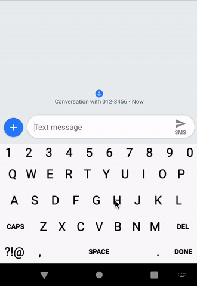

# Custom keyboard layout

The keys on the keyboard rearrange after each new input such that
1. keys within a word will be more close to each other
2. words are most distinguishable among each other
